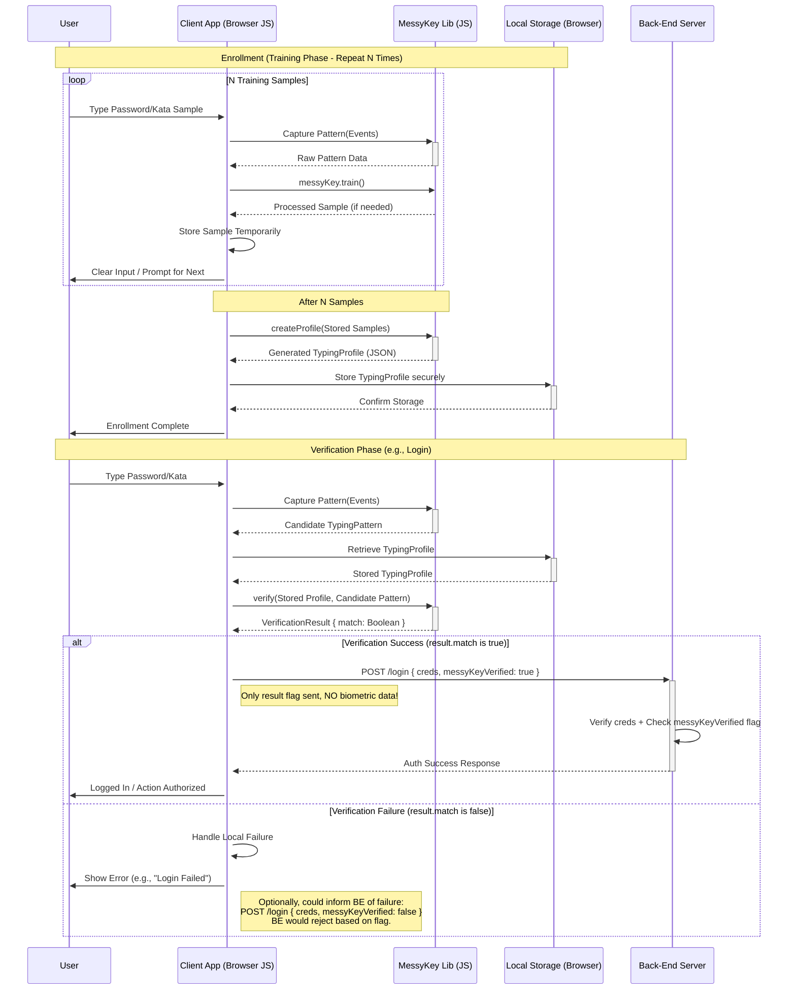

 
# 🔐 MessyKey: Behavioral Biometric Authentication Protocol

[](https://opensource.org/licenses/MIT)

**MessyKey is an open *protocol* (and reference implementation) for adding a lightweight layer of behavioral biometric authentication based on typing patterns.** It enhances security by analyzing *how* you type, not just *what* you type, and it's designed to be local-first and privacy-respecting.

**Think of it as a *user-defined* 2FA that's unique to your typing style, including your typical mistakes and corrections!**

## ⚠️ Important Note

MessyKey is an *additional* security layer, **not** a replacement for strong passwords. It is vulnerable to sophisticated side-channel attacks (see [Security Considerations](#security-considerations)). Use it to enhance security, but always with other robust security practices.

## 🌟 Key Features

* **Local-First:** All data processing and storage happen on the user's device. No data leaves your device.
* **Privacy-Respecting:** Only timing metadata and key sequence information are used. The actual password content is *never* stored or processed by MessyKey.
* **Lightweight:** Minimal computational overhead and code footprint.
* **Easy Integration:** Designed for integration into web apps, browser extensions, and other projects.
* **Open Standard:** Defined by a clear protocol specification ([protocol.md](protocol.md)), encouraging independent implementations.
* **Key Up and Key Down Events:** Captures timing for both key press and release.
* **Sequence-Aware:** Captures the *exact* sequence of keystrokes, including backspaces, corrections, and hesitations. "pwe<Backspace>d123" is different from "pwd123".

## 💡 The MessyKey Difference: Novelty and Deeper Security

MessyKey offers a distinct approach compared to traditional authentication and many cloud-based biometric solutions. Its novelty lies in the synergistic combination of several core principles:

1.  **Truly Local-First Biometrics:** Unlike systems that send your typing data (even anonymized or derived) to the cloud for analysis, MessyKey performs **all processing and storage directly on the user's device.** This fundamental design choice drastically enhances **user privacy** and **security** by eliminating server-side data breaches and removing reliance on third-party infrastructure for core authentication logic.

2.  **Deep Sequence Awareness:** MessyKey goes beyond simple inter-key timing. It meticulously records the **entire, ordered sequence of `keydown` and `keyup` events.** This includes:
    * The specific keys pressed.
    * Corrections made using `<Backspace>` or `Delete`.
    * The precise timing and rhythm of these actions.
    This detailed sequence capture provides a much richer, more unique biometric signature than methods focusing only on the timing of correctly typed characters.

3.  **Enabling Advanced, Layered Patterns:** The local-first, sequence-aware foundation allows for sophisticated security techniques not easily achievable otherwise:
    * **Typing Kata Authentication:** Users can intentionally create and train complex, procedural "Katas" (e.g., `"She loves me<DeleteAll>she loves me not<DeleteAll>she loves me!"`). This turns the typing pattern into a high-entropy, user-defined *procedural secret* combined with their unique execution timing. It's vastly more resistant to observation and guessing than standard passwords or simple timing biometrics.
    * **Context-Specific Sequences:** The protocol allows for using *different* typing patterns or variations to authorize actions with varying security requirements *within the same application*. For example, a standard pattern for login, but a more deliberate or complex pattern (perhaps a mini-Kata) required for a high-value transaction. This provides **granular, behavioral step-up authentication** without necessarily interrupting the user flow for a separate 2FA step.

In essence, MessyKey provides the tools (via its open protocol) to build authentication systems that leverage not just *natural* typing behavior, but also *intentional, complex, context-aware* user input patterns, all while rigorously protecting user privacy through its local-first architecture.

## 🚀 How it Works

MessyKey analyzes your unique typing *pattern*:

* **Which keys you press:** Including letters, numbers, symbols, and special keys like Backspace and Shift.
* **The exact sequence:** "pas<Backspace><Backspace>sword" is different from "password".
* **Timing between key presses:** (`keydown` events).
* **Key hold duration:** (`keydown` to `keyup`).
* **Time between key release and next press:** (`keyup` to `keydown`).

This creates a unique "typing profile." During login (or other context-specific actions), MessyKey compares your current typing to your stored profile(s). A match (within tolerance) grants access or authorization.



## 📦 Getting Started (JavaScript Example)

This repository includes a reference implementation in JavaScript.

1.  **Include `messykey.js`:**
    ```html
    <script type="module" src="src/messykey.js"></script>
    ```
2.  **Use the `useMessyKey` hook:**
    ```javascript
    import { useMessyKey } from './messykey.js';

    const passwordInput = document.getElementById('password');
    const messyKey = useMessyKey(passwordInput);

    // --- Training ---
    let typingProfiles = []; // Store multiple raw profiles for averaging
    let myTrainedProfile = null; // The final averaged profile

    trainButton.onclick = () => {
        const rawProfile = messyKey.train(); // Get profile from current pattern
        if (rawProfile) { // Check if a pattern was actually captured
             typingProfiles.push(rawProfile);
             console.log(`Captured training sample ${typingProfiles.length}.`);
             messyKey.reset(); // Clear the pattern input immediately after training
             passwordInput.value = ''; // Clear the input field
             passwordInput.focus(); // Ready for next input

             // Recommendation: Require a minimum number of samples (e.g., 5)
             if (typingProfiles.length >= 5) {
                 // Create the final averaged profile from the collected samples
                 myTrainedProfile = messyKey.createProfile(typingProfiles);
                 console.log("Averaged Profile trained and ready:", myTrainedProfile);
                 // Optionally clear typingProfiles array if no longer needed
                 // typingProfiles = [];
            }
        } else {
            console.log("No pattern captured for training. Please type something.");
        }
    };

    // --- Verification ---
    verifyButton.onclick = () => {
      if (!myTrainedProfile) {
          console.log("Profile not trained yet. Please complete training.");
          return;
      }
      const currentPattern = messyKey.getPattern(); // Get pattern from current input
       if (!currentPattern || currentPattern.length === 0) {
            console.log("No pattern captured for verification. Please type something.");
            return;
       }

      const result = messyKey.verify(myTrainedProfile, currentPattern);

      if (result.match) {
        console.log('Access granted!', result);
        // Application logic for success (e.g., proceed with login)
      } else {
        console.log('Access denied.', result);
        // Application logic for failure (e.g., show error message)
      }
      // Always reset after verification attempt for security
      messyKey.reset();
      passwordInput.value = '';
      passwordInput.focus();
    };

    // --- Reset Training ---
    resetTrainingButton.onclick = () => { // Assuming you have a button with this ID
        typingProfiles = [];
        myTrainedProfile = null;
        messyKey.reset();
        passwordInput.value = '';
        console.log("Training reset. Ready to start training again.");
        passwordInput.focus();
    };
    ```
    See `demo/index.html` for a complete working example.

## 📖 Protocol Specification

**This project is defined by a formal protocol.** For a detailed description of the MessyKey *protocol*, including data structures, operations, advanced patterns, and security considerations, see the [PROTOCOL.md](PROTOCOL.md) file. This document outlines the standard that any implementation should follow.

## 🛡️ Security Considerations

* **Side-Channel Attacks:** MessyKey is vulnerable to side-channel attacks. Attackers might infer timing (network traffic, CPU usage, acoustic emanations). **Mitigation:** Run core logic in a **Web Worker** for isolation. Consider adding subtle, random delays (noise injection).
* **Replay Attacks:** Capturing raw timing data allows replay. **Mitigation:** Use Web Workers, avoid exposing raw timing data. Katas and Context-Specific patterns increase replay difficulty.
* **Not a Password Replacement:** MessyKey is an *additional* security layer.
* **User Consistency:** Effectiveness depends on consistent typing. Training and tolerance settings are key.
* **Fallback Mechanism:** **MUST** include a robust fallback (e.g., traditional password entry).

## 🤝 Contributing

Contributions welcome!

1.  Fork the repository.
2.  Create a new branch.
3.  Make your changes and commit.
4.  Submit a pull request.

To understand more about why I created this protocol, see [about.md](about.md)

## 📝 License

MessyKey is released under the [MIT License](LICENSE).
```
 
