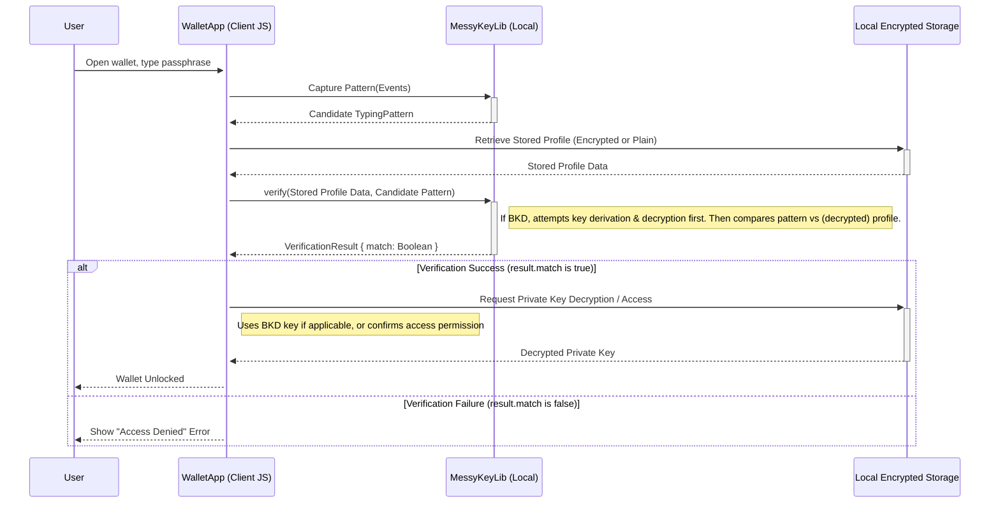

**Protocol Version:** 2.0.0
**Document Status:** Draft / Ongoing

---

## 1. The Persistent Threat: Key Theft in Crypto

Cryptocurrency's greatest strength – user sovereignty via private keys – is also its greatest vulnerability. If an attacker acquires your private key, they control your funds. Period. Blockchain transactions are final. The scale of this problem is staggering:

* Significant sums (billions annually) are lost to exploits, hacks, and scams (source: various blockchain security reports).
* A major vector remains compromised credentials: phishing, malware, reused passwords, or weak passphrases protecting software wallets.
* Many users store private keys locally, secured only by a single passphrase. Once breached, the keys are exposed, and funds are often irreversibly lost.

In today's global crypto landscape, where security and user privacy are paramount (perspectives strongly emphasized in regions like Europe), relying solely on knowledge factors is insufficient.

---

## 2. How MessyKey v2.0 Provides a Solution

MessyKey is an open protocol (v2.0.0) for keystroke-based behavioral biometric authentication. It enhances traditional passphrase security by analyzing *how* you type, adding crucial layers of protection directly on your device:

* **Stolen Passphrase Becomes Insufficient:** Knowing *what* to type isn't enough. An attacker must also replicate *how* you type – your unique rhythm, speed, error patterns, and hesitations. This behavioral signature is incredibly difficult to mimic accurately.
* **Radically Local-First Security:** All biometric analysis and profile storage happen **exclusively on your device**. No typing patterns, biometric templates, or sensitive derived data are sent to external servers. This respects user privacy and eliminates central repositories as honeypots for attackers.
* **Enhanced Replay Resistance:** Standard password replay is ineffective due to the behavioral check. Furthermore, MessyKey v2.0's **Dynamic Challenge-Response Katas** (see below) make even sophisticated replay attacks (using previously recorded typing patterns) infeasible for high-security actions.

---

## 3. Under the Hood: The Core Innovations at Work

MessyKey v2.0 achieves this through several key technical features:

* **Deep Behavioral Analysis:** Goes far beyond simple speed. It analyzes:
    * **Full Keystroke Dynamics:** Precise timing of keydown, keyup, time between keys (DownDown, DownUp, UpDown latencies).
    * **Error Patterns & Correction Strategies:** Learns *your* typical mistakes (transpositions, adjacent keys) and *how* you fix them (e.g., quick single backspace vs. multi-delete). Messiness becomes a feature!
    * **Micro-Hesitations & Flow:** Profiles your characteristic pauses and typing bursts.
    * *Benefit:* This captures your ingrained habits, creating a rich, multi-dimensional profile that's much harder for attackers using generic typing bots or even manual mimicry to replicate.

* **Dynamic Challenge-Response Katas:**
    * For high-security operations, the system can present a unique, session-specific `Challenge` (e.g., a random prefix). The user must type their complex, pre-trained Kata *adapted* to this challenge.
    * *Benefit:* This active verification step ensures "liveness" and makes replaying previously recorded typing patterns impossible, providing integrated MFA-like security without needing a separate device.

* **Biometric Key Derivation (BKD) (Optional but Powerful):**
    * Your unique typing pattern *when entering the passphrase* can be used, via sophisticated cryptographic techniques (Fuzzy Extractors/KDFs specified in the protocol), to derive a cryptographic key.
    * This BKD-derived key can then be used to directly decrypt your stored private key, or to unlock a secondary encryption layer also protected by your passphrase text (providing layered security).
    * *Benefit:* This means even if an attacker steals your entire encrypted wallet file, it's cryptographically useless without your live, correctly-timed typing input. It creates a **self-securing** profile/key store, significantly hardening against offline attacks.

---

## 4. Example Scenario: Securing a Software Wallet

1.  **Enrollment:**
    * You install a MessyKey-enabled wallet.
    * During setup, it prompts you to type your chosen strong passphrase 5-10 times.
    * MessyKey analyzes these samples, capturing timing, error patterns, and hesitations, creating your `TypingProfile`.
    * *(Optional BKD):* If using BKD, a secret key is derived from your typing patterns, and public `BKDHelperData` is generated.
    * Your private key is encrypted (potentially using the BKD-derived key) and stored locally alongside the (potentially BKD-encrypted) `TypingProfile` and `BKDHelperData`.

2.  **Unlocking Your Wallet:**
    * You open the wallet and type your passphrase.
    * MessyKey captures the `TypingPattern`.
    * *(Optional BKD):* MessyKey attempts to reconstruct the decryption key using the `TypingPattern` and stored `BKDHelperData`. If it fails, access denied.
    * MessyKey compares the `TypingPattern` (sequence, timing, errors, hesitations) against the (now decrypted, if BKD was used) `TypingProfile`.
    * If the pattern matches within acceptable thresholds -> **Success:** The wallet decrypts and loads your private key.
    * If the pattern doesn't match -> **Failure:** Access denied, even if the passphrase text was correct.

3.  **Dynamic Challenge-Response (Optional High-Value Transfer):**
    * You initiate a large transfer (€5,000+).
    * The wallet displays a unique challenge code (e.g., `TX9`).
    * You are prompted to type `TX9` immediately followed by your passphrase (or a specific Kata).
    * MessyKey verifies the challenge integration *and* the behavioral pattern of the combined input. Only upon success is the transaction signed.

---

## 5. Use Cases and Specific Applications

### 5.1. Software Wallets (Primary Use Case)
* **Goal:** Protect locally stored private keys from theft via compromised passphrases.
* **Integration:** Use MessyKey `train()` during setup. Use `verify()` on unlock attempts. Optionally use BKD to make the stored private key dependent on correct typing behavior for decryption.

### 5.2. Hardware Wallet Companion Apps
* **Goal:** Add a behavioral check before sending sensitive commands (like signing requests or passphrase unlocks) to the hardware device.
* **Integration:** The desktop/mobile app uses MessyKey `verify()` on passphrase input *before* interacting with the connected hardware wallet, adding a hurdle for malware or unauthorized users on the host machine.

### 5.3. dApp Front-Ends / Web Wallets
* **Goal:** Prevent unauthorized transaction signing requests originating from the browser/client-side.
* **Integration:** Before prompting `window.ethereum.request({ method: 'eth_sendTransaction', ... })` or similar, the dApp front-end requires the user to authenticate the action via MessyKey `verify()` (potentially with a Dynamic Challenge based on transaction details). This adds a user-verification layer independent of the wallet's own unlock state. *Crucially, this is purely a client-side check to gate the signing request.*

### 5.4. Decentralized Identity (DID) Wallets
* **Goal:** Secure the private keys used for signing Verifiable Credentials or authenticating DID methods.
* **Integration:** Similar to software wallets, use MessyKey `verify()` to unlock the keys needed for identity-related operations, ensuring only the legitimate holder can assert their identity cryptographically.

---

## 6. Mermaid Sequence Diagram (Wallet Unlock)



Explanation: The diagram shows the user typing, the wallet capturing it, MessyKey performing verification against the stored profile (including potential BKD decryption), and unlocking the key store only upon a successful behavioral match.
7. Other Potential Use Cases
 * Password Manager Vaults: Secure local password databases with typing behavior + master password.
 * High-Privilege Operations ("Keystroke Sudo"): Require a Dynamic Kata for critical admin commands in enterprise or development environments.
 * Securing Seed Phrase Recovery: Potentially apply behavioral checks during the highly sensitive process of entering a seed phrase (requires very careful implementation to avoid locking users out).
 * Offline / Edge Devices: Provide local biometric verification where network connectivity is unavailable.


8. Where It Doesn't Work (or Has Gaps)
 * Device-Level Malware: Advanced keyloggers, screen scrapers, or rootkits running on the user's machine can potentially intercept or manipulate typing events before MessyKey sees them. MessyKey raises the bar significantly but cannot fully defeat a totally compromised OS.
 * Physical Coercion / High-Fidelity Observation: If an attacker forces the user to type or uses extremely high-fidelity recording (e.g., specialized cameras + acoustic analysis), replication might be possible, though difficult. Dynamic Challenges provide strong mitigation here.
 * User Variability / Different Keyboards: Significant changes in typing style (injury, stress) or using a drastically different keyboard can lead to false rejections (FRR). Robust fallback mechanisms and potential re-enrollment flows are essential. BKD implementations must carefully consider tolerance.
9. Get Started with MessyKey in Your Crypto Project
 * Explore the Repo: Clone or download this repository.
 * Read the Protocol: Understand the data structures (TypingProfile, Challenge, etc.) and operations (train, verify) in the MessyKey Protocol Specification (v2.0.0).
 * Integrate: Use the reference implementation (or build your own based on the protocol):
   * Call messyKey.train() during wallet setup/enrollment, storing the resulting profile securely. Choose a suitable profileFormatIdentifier (e.g., "MessyKeyProfile/EnhancedAveraged/v2.0" or "MessyKeyProfile/BKDEncrypted/v2.0").
   * Call messyKey.verify() during unlock or action confirmation flows.
   * If using Dynamic Challenges, generate challenges securely and pass them to verify().
 * Adapt UI: Ensure your UI clearly prompts the user, captures input in the monitored field, and handles success/failure responses from MessyKey appropriately.
 * Implement Fallbacks: Always provide a secure way for users to regain access if MessyKey verification fails repeatedly (e.g., via seed phrase recovery, social recovery - ensuring those paths are also secure).

```javascript
// Conceptual Integration Snippet
import { useMessyKey } from 'messykey-library'; // Assuming library exists

async function unlockWallet(passphraseInput) {
  const messyKey = useMessyKey(passphraseInput); // Initialize on the input field
  const pattern = messyKey.getCurrentPattern();
  const storedProfile = await loadProfileFromSecureStorage(); // Load profile

  if (storedProfile) {
    try {
      const result = await messyKey.verify(storedProfile, pattern);
      messyKey.reset(); // Clear pattern immediately

      if (result.match) {
        const privateKey = await decryptPrivateKey(); // Decrypt using BKD key or other mechanism
        console.log("Wallet Unlocked!");
        return privateKey;
      } else {
        console.error("MessyKey verification failed.");
        showError("Incorrect passphrase or typing pattern mismatch.");
        return null;
      }
    } catch (verificationError) {
       console.error("Error during MessyKey verification:", verificationError);
       showError("Authentication system error.");
       messyKey.reset();
       return null;
    }
  } else {
     // Handle case where no profile exists (e.g., first use, prompt enrollment)
     console.log("No MessyKey profile found.");
     // Fallback or prompt enrollment
     return null;
  }
}
'''

## License: MIT License (or your chosen license)
Contributions, issues, and pull requests are welcome! We're especially interested in seeing MessyKey integrated into real-world crypto wallets and DID solutions.


### Disclaimer: MessyKey v2.0 offers significant advancements in resisting common credential theft attacks. However, no single security measure is foolproof. Always employ a layered security approach: use strong, unique passphrases, safeguard seed phrases offline, keep devices malware-free, and be wary of phishing.

